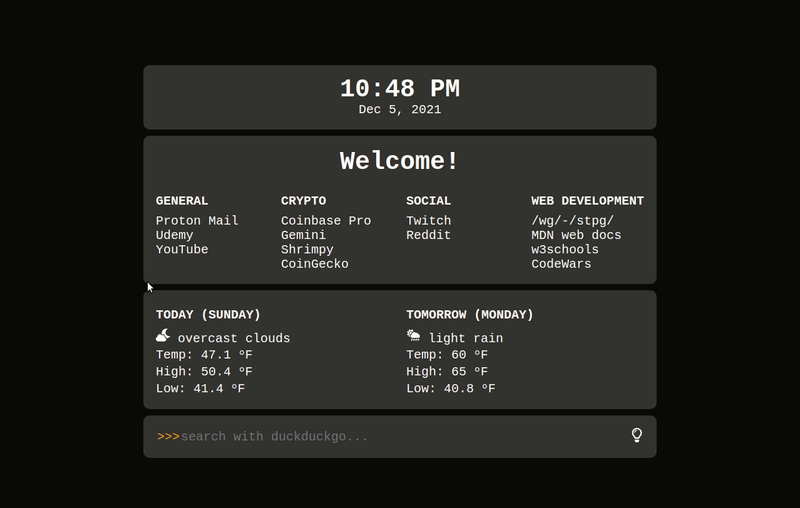
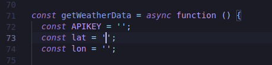

# My first start page

This is a simple start page I started using a lesson/guide from [stpg.tk](https://stpg.tk/guides/basic-startpage). After a lot of studying and trial and error, I have added a few enhancements.

## Features:

- Functional clock.
- Light and Dark mode.
- Hover effects on links change based on light vs dark mode.
- Weather widget showing current weather and tomorrow's forecast.
- DuckDuckGo search bar.

## Instructions:

If you wish to use this start page for yourself, you will need 2 things:

- Your own API key from [openweathermap.org](https://openweathermap.org/appid).
- Your latitude and longitude coordinates. This can be found using [LatLong.net](https://www.latlong.net/).

Once obtained, enter the appropriate items into lines 72, 73, and 74 of script.js.

