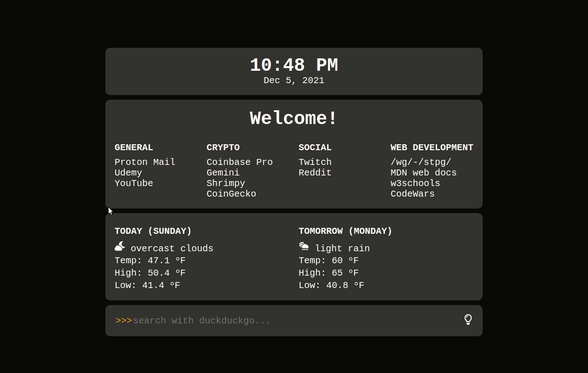
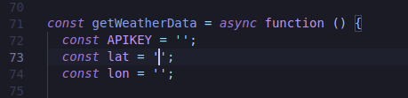

# startpage-az

<<<<<<< HEAD
This is a simple start page I started using a lesson/guide from [stpg.tk](https://stpg.tk/guides/basic-startpage/). After a lot of studying, as well as trial and error, I have added a few enhancements.

## Features:

- Functional clock.
- Light and Dark mode.
- Hover effects on links change based on light vs dark mode.
- Weather widget showing current weather and tomorrow's forecast.
- DuckDuckGo search bar.
=======
A simple start page.

V3 - June 2024 - Major code referactor and updated OpenWeather API

## Features:

- Functional clock with current weather conditions
- Light and Dark mode
- Hover effects on links change based on light vs dark mode
- Weather widget showing today's and tomorrow's forecast
- DuckDuckGo search bar
>>>>>>> 08b2682 (V3 - June 2024 - Major code referactor and updated OpenWeather API)

## Installation:

- Download the repository as a folder stored somewhere on your computer.
- Open the startpage.html file in your browser.
- Copy the path in the URL bar.
- Install a new tab redirect extension (like this one).
- Set the new tab URL to the path you copied earlier.
- Refer to the following section to finish setup.

## Instructions For Personal Use:

If you wish to use this start page for yourself, you will need 2 things:

- Your own API key from [openweathermap.org](https://openweathermap.org/appid/).
- Your latitude and longitude coordinates. This can be found using [LatLong.net](https://www.latlong.net/).

<<<<<<< HEAD
Once obtained, enter the appropriate items into lines 72, 73, and 74 of script.js.

=======
Once obtained, enter the appropriate items into lines 59, 60 and 61 of script.js

>>>>>>> 08b2682 (V3 - June 2024 - Major code referactor and updated OpenWeather API)
